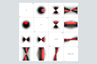

# Optimized Brushing

Brushing is a powerful technique of interactive graphics, highlighting linked data in multiple views. When it was developed in the 1980s, brushing was limited to a few hundred points.  On modern hardware, we can brush many more.

[This project demonstrates usability and performance optimizations for brushing.](https://hemanrobinson.github.io/fast-brushing/)

