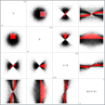

# Optimized Brushing

[This project demonstrates usability and performance optimizations for brushing.](https://hemanrobinson.github.io/fast-brushing/)

Brushing is a basic technique of exploratory data analysis, developed in the 1970s ([Fishkeller, Friedman, and Tukey](https://www.researchgate.net/publication/245345268_An_interactive_multidimensional_data_display_and_analysis_system)) and 1980s ([Becker and Cleveland](https://www.jstor.org/stable/1269768?seq=1), [Stuetzle](https://www.jstor.org/stable/2289448?seq=1)).  Among its first uses was exploring two-dimensional relationships in a scatter plot matrix.

This project uses [d3](https://github.com/d3/d3) and [Material-UI](https://github.com/mui-org/material-ui), and was bootstrapped with [Create React App](https://github.com/facebook/create-react-app).
